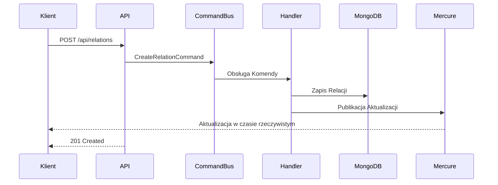
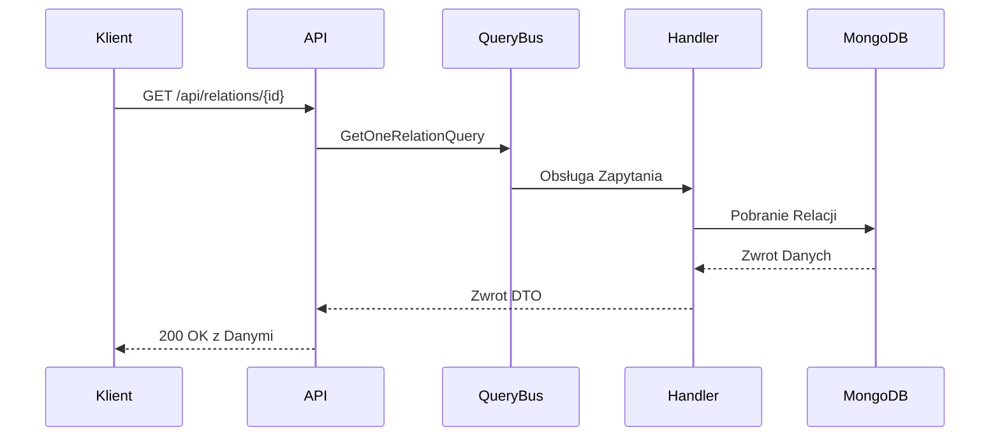
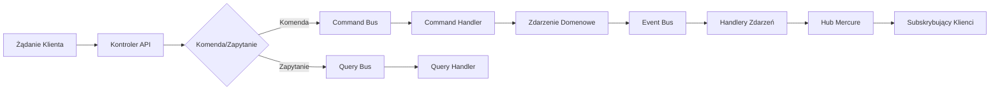

# liveblog


## Uruchomienie Środowiska Deweloperskiego
- Sklonuj repozytorium
- Skopiuj .env do .env.local i dostosuj wartości
- Uruchom
  ```docker-compose up -d```
- Zainstaluj zależności: 
```composer install```

## liveblog-api [Dokumentacja](relation-api/README.md)

# LiveBlog Relation API

System zarządzania relacjami z obsługą aktualizacji w czasie rzeczywistym przy użyciu Mercure. Aplikacja zbudowana jest w oparciu o framework Symfony.

## Architektura Systemu

System wykorzystuje następujące kluczowe komponenty:
- Framework Symfony
- MongoDB jako baza danych
- RabbitMQ do kolejkowania wiadomości
- Mercure do aktualizacji w czasie rzeczywistym
- Docker do konteneryzacji

#### messanger
```
php bin/console messenger:consume async -vv
```

#### phpstan
```
php vendor/bin/phpstan analyse
```
#### behat
```
APP_ENV=test vendor/bin/behat
```

## Główne Funkcjonalności


### 1. Przepływ Zarządzania Relacjami

### Dodawanie relacji

#### Tworzenie Relacji



### Zmiana statusu
```mermaid
sequenceDiagram
    participant Klient
    participant API
    participant CommandBus
    participant Handler
    participant MongoDB
    participant Mercure

    Klient->>API: POST /api/relations/{id}/change_status
    API->>CommandBus: RelationChangeStatusCommand
    CommandBus->>Handler: Obsługa Komendy
    Handler->>MongoDB: Aktualizacja Statusu
    Handler->>Mercure: Publikacja Zmiany Statusu
    Mercure-->>Klient: Aktualizacja w czasie rzeczywistym
    API-->>Klient: 200 OK
 ```

### Usuwanie relacji

```mermaid
sequenceDiagram
participant Klient
participant API
participant CommandBus
participant Handler
participant MongoDB
participant Mercure

    Klient->>API: DELETE /api/relations/{id}
    API->>CommandBus: RelationDeleteCommand
    CommandBus->>Handler: Obsługa Komendy
    Handler->>MongoDB: Usunięcie Relacji
    Handler->>Mercure: Publikacja Usunięcia
    Mercure-->>Klient: Aktualizacja w czasie rzeczywistym
    API-->>Klient: 204 No Content
```

### Pobieranie relacji



### Przepływ Zdarzeń


## Autorzy
Wojciech Borek

## Licencja
Ten projekt jest licencjonowany na warunkach licencji MIT.
